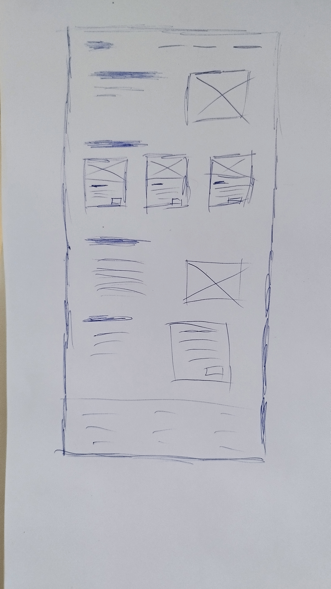

# Figma Proeverij
- [Figma Proeverij](#figma-proeverij)
  - [Wat gaan we doen?](#wat-gaan-we-doen)
  - [figma gebruiken](#figma-gebruiken)
  - [inspiratie opdoen](#inspiratie-opdoen)
  - [wireframing](#wireframing)
  - [figma ui](#figma-ui)
  - [tips rondom figma](#tips-rondom-figma)
  - [assets](#assets)
    - [Kleuren](#kleuren)
    - [Design](#design)
      - [Desktop](#desktop)
      - [Phone](#phone)
  

## Wat gaan we doen?
- We gaan kennis maken met het design process van een website
- we gaan leren wireframen
- we gaan leren met figma werken
- we gaan leren hoe we ons design een beetje tot leven kunnen krijgen
- en we gaan wat handige tools onderweg bekijken

## figma gebruiken
 figma kunnen we installeren als desktop aplicatie of in onze browser gebruiken, figma is compleet gratis voor induviduelen.

 ## inspiratie opdoen
 - voordat we beginnen met een website moeten we kijken wat we leuk vinden. ik doe dit vaak op [Awwwards.com](https://awwwards.com)

 ## wireframing
 - waarom maken we wireframes?
 - hoe maken we wireframes?
 - wat zijn de universele wireframe blokken?

 > gebruik affinity designer met de wacom tekentablet

 

## figma ui
- hoe werkt de ui van figma?
- wat zijn onze basic tools
- layers vs assets
- plugins
- tools bovenin
- design sectie
- prototype sectie
- inspect sectie

## tips rondom figma
-   components
-   guides
-   plugins
    -   pexels
    -   lorem ipsum

## assets

### Kleuren

    

[coolors pallete](https://coolors.co/1e1e1e-d90368-959595-cbd4c2-ffffff)

### Design

Ik heb gekozen voor een simpel minimalist design, hierdoor is er genoeg ruimte voor de kijkers het te personalizeren. ook door de kleuren en lettertypen aan te passen voelt het al snel als een andere "eigen" site.

#### Desktop

---

  

---

---

#### Phone

---

---

[Figma design file](https://www.figma.com/file/RUemNh8oLXEDPh9026GYa7/design-proevenrij?node-id=0%3A1)

